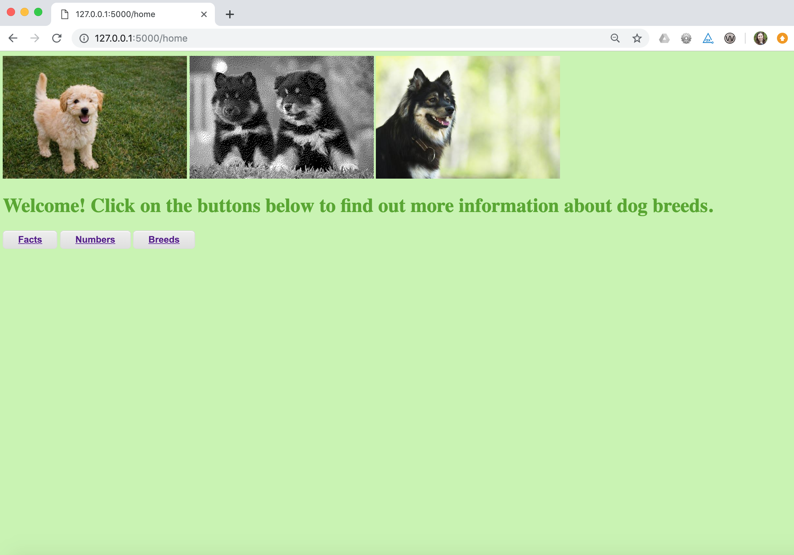
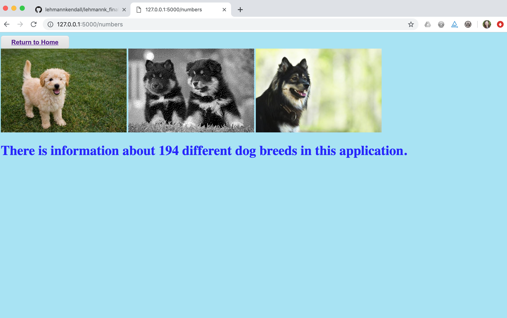
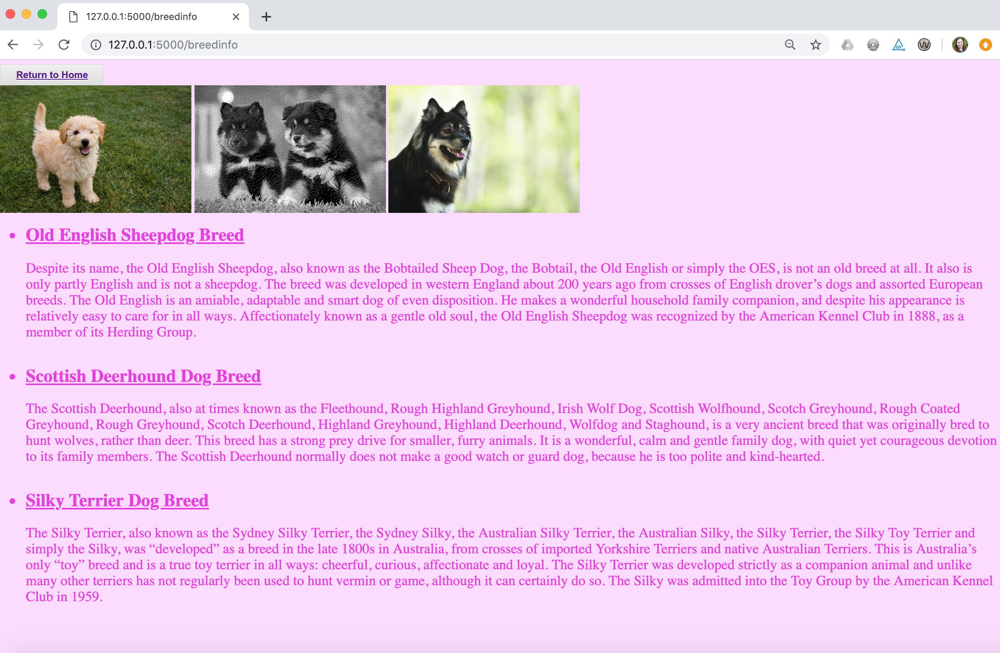
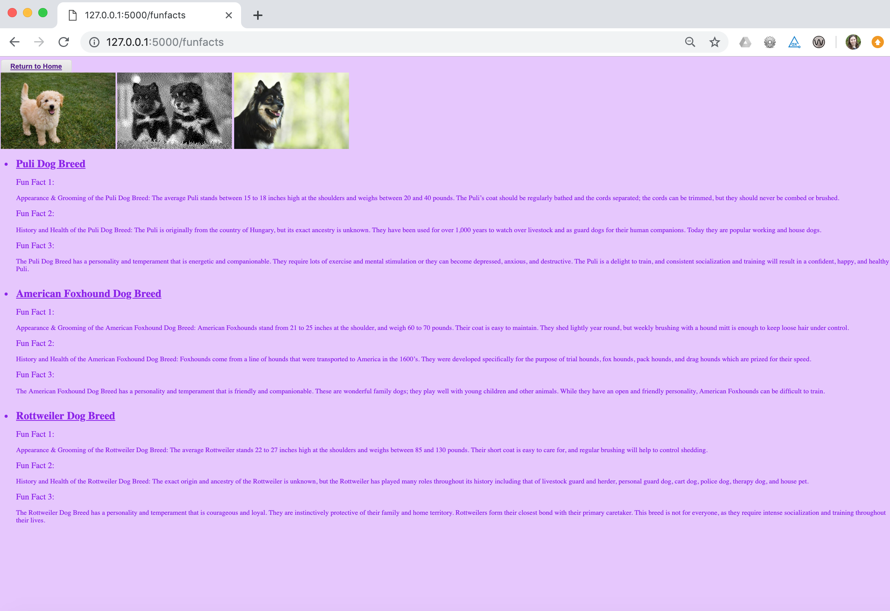

# Project Title

Dog Breed Application

Link to this repository: https://github.com/lehmannkendall/lehmannk_finalproject

By: Kendall Lehmann (lehmannk)

**I think I am mostly done with the project, but will continue to work on/review**

---

## Project Description

The dog breed application provides information about a variety of dog breeds. The project scrapes data from https://www.petwave.com/Dogs/Breeds.aspx. This data is then put into a CSV and then put into two tables (Breed and Facts) in a database. In the Breed table there is information about the breed name and a description/overview of the breed (and the fact_id). In the Fact table there is information about the breed name, fun fact 1, fun fact 2, and fun fact 3. There are 4 flask routes in the dog breed application. The first route is a homepage that welcomes users and provides button links to other pages. The second route is information about the numbers of breeds available. The third route is information about the dog breed name and that dog breed's overview. The fourth route is information about the dog breed name and that dog breed's fun fact 1, fun fact 2, and fun fact 3.

## How to run

1. First, you should install all requirements with `pip install -r requirements.txt`
2. Second, you should download SI507project_tools.py and SI507project_tests.py and the templates folder and the static folder and the advanced_expiry_caching.py file in the same directory.
3. Third, you should run `python SI507project_tools.py runserver` in the terminal window to run the application.
4. Fourth, to test the code from SI507project_tools.py, run `python SI507project_tests.py` in the terminal window.

## How to use

1. In Google Chrome (or other browser) type in: localhost:5000/home in the URL for the homepage.

2. In Google Chrome (or other browser) type in: localhost:5000/numbers in the URL for the numbers page OR click on the 'numbers' button.

3. In Google Chrome (or other browser) type in: localhost:5000/breedinfo in the URL for the breed information page OR click on the 'breeds' button.

4. In Google Chrome (or other browser) type in: localhost:5000/funfacts in the URL for fun facts related to two breeds OR click on the 'facts' button. (needed to zoom out for the screenshot so it all fit on one page)

## Routes in this application
- `/home` -> this is the home page that provides button links to the other pages
- `/numbers` -> this is a page that displays how many types of breeds are represented in the dataset
- `/breedinfo` -> this route displays one random breed name and a description of the breed
- `/funfacts` -> this route displays two random breeds and three fun facts that go along with each breed

## How to run tests
1. First access the directory that you placed all the necessary files in (from 'how to run' section of readme)
2. As mentioned in step 4 of 'how to use' section of readme, in order to test the code from SI507project_tools.py, run `python SI507project_tests.py` in the terminal window.

## In this repository:
- Main Files
  - SI507project_tools.py
  - SI507project_tests.py
  - advanced_expiry_caching.py
  - README.md
  - requirements.txt
  - templates folder (with breeds.html, numbers.html, facts.html, home.html)
  - stataic folder (with dog.jpg, puppies.jpg, puppy.jpg)

- Example Files (can be removed because code in SI507project_tools.py should generate all of these files)
  - dogs_cache.json
  - dogs.db
  - dogs_info.csv
  - new_puppies.jpg (within static folder)

- Diagrams
  - SI507_final_database_plan.jpg
  - screenshots folder (images to show how app should look)

---
## Code Requirements for Grading

### General
- [x] Project is submitted as a Github repository
- [x] Project includes a working Flask application that runs locally on a computer
- [x] Project includes at least 1 test suite file with reasonable tests in it.
- [ ] Includes a `requirements.txt` file containing all required modules to run program
- [x] Includes a clear and readable README.md that follows this template
- [x] Includes a sample .sqlite/.db file
- [x] Includes a diagram of your database schema
- [x] Includes EVERY file needed in order to run the project
- [x] Includes screenshots and/or clear descriptions of what your project should look like when it is working

### Flask Application
- [x] Includes at least 3 different routes
- [x] View/s a user can see when the application runs that are understandable/legible for someone who has NOT taken this course
- [x] Interactions with a database that has at least 2 tables
- [x] At least 1 relationship between 2 tables in database
- [x] Information stored in the database is viewed or interacted with in some way

### Additional Components (at least 6 required)
- [x] Use of a new module - PIL
- [ ] Use of a second new module
- [ ] Object definitions using inheritance (indicate if this counts for 2 or 3 of the six requirements in a parenthetical)
- [ ] A many-to-many relationship in your database structure
- [ ] At least one form in your Flask application
- [x] Templating in your Flask application
- [x] Inclusion of JavaScript files in the application -- within the html templates
- [x] Links in the views of Flask application page/s
- [ ] Relevant use of `itertools` and/or `collections`
- [x] Sourcing of data using web scraping
- [ ] Sourcing of data using web REST API requests
- [ ] Sourcing of data using user input and/or a downloaded .csv or .json dataset
- [x] Caching of data you continually retrieve from the internet in some way

### Submission
- [ ] I included a link to my GitHub repository with the correct permissions on Canvas!
- [ ] I included a summary of my project and how I thought it went **in my Canvas submission**!
